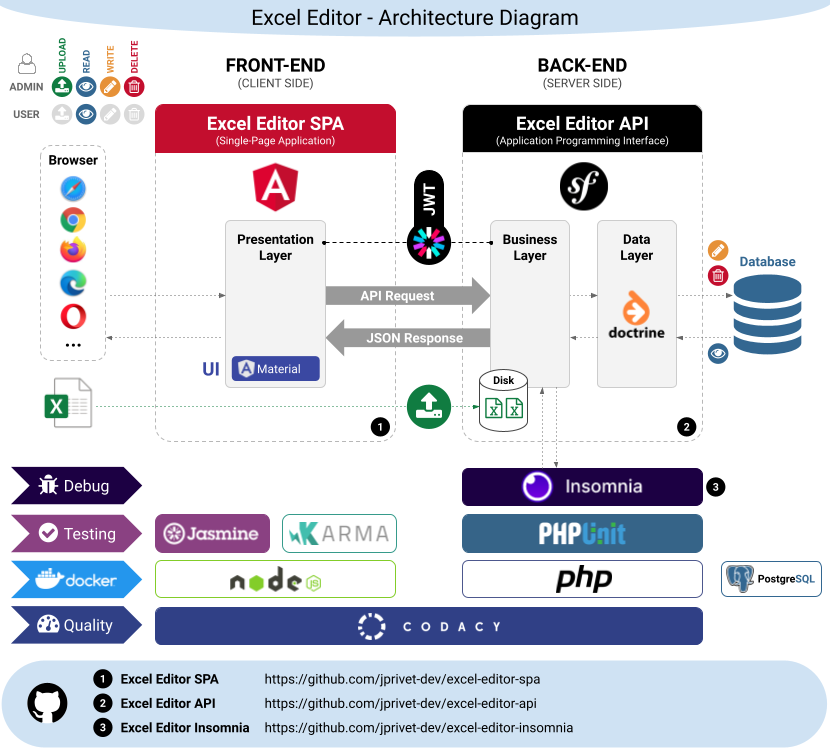
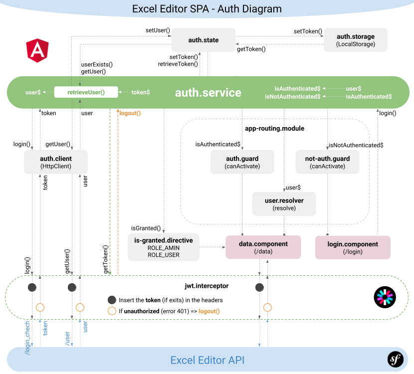
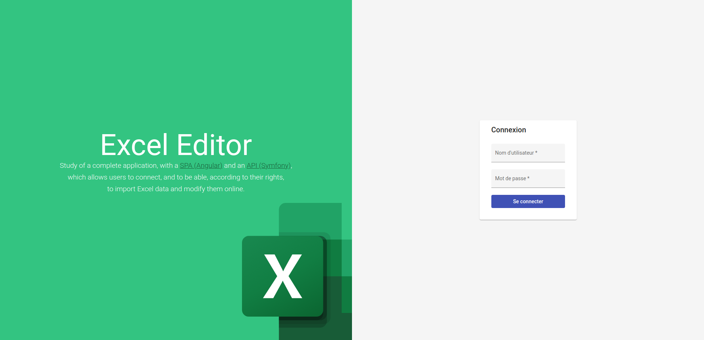
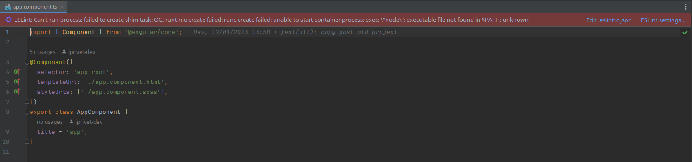
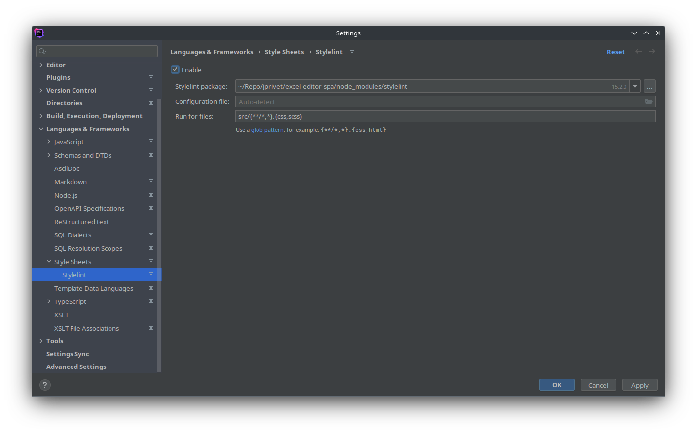
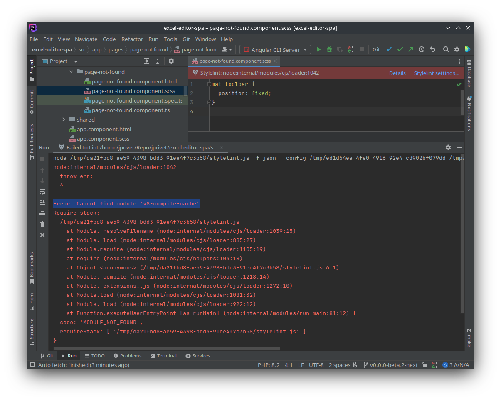

:toc: macro
:toc-title: Summary
:toclevels: 3
:numbered:

ifndef::env-github[:icons: font]
ifdef::env-github[]
:status:
:outfilesuffix: .adoc
:caution-caption: :fire:
:important-caption: :exclamation:
:note-caption: :paperclip:
:tip-caption: :bulb:
:warning-caption: :warning:
endif::[]

:back_to_top_target: top-target
:back_to_top_label: ⬆ Back to top
:back_to_top: <<{back_to_top_target},{back_to_top_label}>>

:main_title: Excel Editor SPA
:git_project_base: excel-editor
:git_project_api: {git_project_base}-api
:git_project_spa: {git_project_base}-spa
:git_project_insomnia: {git_project_base}-insomnia
:git_username: jprivet-dev
:git_url_api: https://github.com/{git_username}/{git_project_api}
:git_url_spa: https://github.com/{git_username}/{git_project_spa}
:git_url_insomnia: https://github.com/{git_username}/{git_project_insomnia}
:git_ssh_api: git@github.com:{git_username}/{git_project_api}
:git_ssh_spa: git@github.com:{git_username}/{git_project_spa}
:git_clone_ssh_api: git@github.com:{git_username}/{git_project_api}.git
:git_clone_ssh_spa: git@github.com:{git_username}/{git_project_spa}.git

:git_project_current: {git_project_spa}
:git_url_current: {git_url_spa}
:git_ssh_current: {git_ssh_spa}

:codacy_project_settings_coverage: https://app.codacy.com/gh/{git_username}/{git_project_api}/settings/coverage

// Releases
:project_release: v0.0.0-beta.2
:angular_release: 14.2.10

[#{back_to_top_target}]
= {main_title}

image:https://badgen.net/badge/release/{project_release}/blue[Project release,link=https://github.com/jprivet-dev/excel-editor-api/releases/tag/{project_release}]
image:https://badgen.net/badge/angular/{angular_release}/d93630[Angular release,link=https://github.com/angular/angular/releases/tag/{angular_release}]
image:https://app.codacy.com/project/badge/Grade/b95abb50479e4198becce900e64885da["Codacy code quality", link="https://www.codacy.com/gh/jprivet-dev/excel-editor-spa/dashboard?utm_source=github.com&utm_medium=referral&utm_content=jprivet-dev/excel-editor-spa&utm_campaign=Badge_Grade"]
image:https://app.codacy.com/project/badge/Coverage/b95abb50479e4198becce900e64885da["Codacy code quality", link="https://www.codacy.com/gh/jprivet-dev/excel-editor-spa/dashboard?utm_source=github.com&utm_medium=referral&utm_content=jprivet-dev/excel-editor-spa&utm_campaign=Badge_Coverage"]

toc::[]

== Presentation

=== SPA, API & Insomnia

Study of a complete application, with a {git_url_spa}[SPA (Angular)] and an {git_url_api}[API (Symfony)], which allows users to connect, and to be able, according to their rights, to import Excel data and modify them online.

|===
| Excel Editor SPA | {git_url_spa}
| Excel Editor API | {git_url_api}
| Excel Editor Insomnia | {git_url_insomnia}
|===

{back_to_top}

=== Diagrams

==== Global architecture



{back_to_top}

==== Authentication & JWT



{back_to_top}

== Prerequisites

=== Docker Compose CLI

IMPORTANT: Be sure to install the latest version of https://docs.docker.com/compose/install/compose-plugin/[Docker Compose CLI plugin].

{back_to_top}

== Installation

WARNING: To use {git_url_spa}[Excel Editor SPA], you will need to install also {git_url_api}[Excel Editor API], an API made with Symfony.

. `$ git clone {git_ssh_current}`.
. `$ cd {git_project_current}`.
. `$ make build`: Build (the first time) or rebuild fresh images if necessary.
. `$ make start`: Create and start containers (alias: `$ make up`).
. Open your browser on http://localhost:4200

TIP: For the following times, you will only need the `$ make start` command to launch the project.



[TIP]
====
* `$ make stop`: Stop and remove containers, networks (alias: `$ make down`).
* `$ make`: See all available make commands.
====

{back_to_top}

== Main technical constraints for the study

* Use of the latest version of https://angular.io/[Angular].
* No https://ngrx.io/[NgRx Store]: the objective is to study in depth https://blog.angular-university.io/how-to-build-angular2-apps-using-rxjs-observable-data-services-pitfalls-to-avoid/[the observable data services and principles].
* Only https://material.angular.io/[Angular Material UI]: no merge with https://ng-bootstrap.github.io/[Bootstrap], https://tailwindcss.com/[tailwindcss], or other CSS frameworks.
* Use mainly the code generation commands (https://angular.io/cli/generate[ng generate]).
* The project must be dockerized.
* The project must have a consistent and correct code coverage.
* The data imported from the excel file are in French: this force us to dissociate the specific language of the data (in French) from the "technical" language of the framework (in English).

{back_to_top}

== Style Guide

=== Angular coding style guide

[NOTE]
====
* https://angular.io/guide/styleguide
====

{back_to_top}

=== JSON naming convention

[NOTE]
====
* https://stackoverflow.com/questions/5543490/json-naming-convention-snake-case-camelcase-or-pascalcase
* https://google.github.io/styleguide/jsoncstyleguide.xml?showone=Property_Name_Format#Property_Name_Format
====

That project (API & SPA) use the `camelCase` format for the property names of JSON responses:

```
{
  "thisPropertyIsAnIdentifier": "identifier value"
}
```

{back_to_top}

== Codacy configuration

=== Code coverage

Duplicate `CODACY_PROJECT_TOKEN.sh`:

```
$ cp scripts/CODACY_PROJECT_TOKEN.sh.dist scripts/CODACY_PROJECT_TOKEN.sh
```

And define the API token `CODACY_PROJECT_TOKEN` (see {codacy_project_settings_coverage}).

The file `scripts/CODACY_PROJECT_TOKEN.sh` is ignored by *Git* and imported by `scripts/reporter.sh`.

The file `scripts/reporter.sh` generates code coverage (a `lcov.info` with *Instanbul*) and uploads the coverage reports on *Codacy*.

[NOTE]
====
* https://github.com/codacy/codacy-coverage-reporter
* https://github.com/karma-runner/karma-coverage
====

TIP: Karma: generate code coverage using https://istanbul.js.org/[Istanbul].

{back_to_top}

=== ESLint

Codacy scans the ESLint configuration in the `.eslintrc.json` file in this repository root.

TIP: PHPStorm can also use ESLint. See <<phpstorm-configure-eslint>>.

[NOTE]
====
More information on:

* https://eslint.org/
* https://app.codacy.com/p/497934/patterns/list?engine=f8b29663-2cb2-498d-b923-a10c6a8c05cd
* https://docs.codacy.com/repositories-configure/configuring-code-patterns/
====

{back_to_top}

=== Stylelint

Codacy scans the Stylelint configuration in the `.stylelintrc` file in this repository root.

We need to install `stylelint-config-standard-scss`:

```
$ npm install --save-dev stylelint stylelint-config-standard-scss
```

And create a `.stylelintrc.json` configuration file:

```json
{
  "extends": "stylelint-config-standard-scss"
}
```

Use the `$ make stylelint` command to execute Stylelint on the `src` folder.

TIP: PHPStorm can also use Stylelint. See <<phpstorm-configure-stylelint>>.

[NOTE]
====
More information on:

* https://app.codacy.com/p/497934/patterns/list?engine=1f03328a-086e-459e-bfa3-73e56f01020f
* https://docs.codacy.com/repositories-configure/configuring-code-patterns/
* https://stylelint.io/user-guide/configure/
* https://stylelint.io/user-guide/get-started/
====

{back_to_top}

== PHPStorm configuration

IMPORTANT: The following configuration are provided for *PHPStorm 2022.3.1*

=== Configure a remote Node.js interpreter [[configure-a-remote-node-js-interpreter]]

. Go in *Settings (Ctrl+Alt+S) > Languages & Frameworks > Node.js*.
. In *Node interpreter*, click on *...* and *Add Remote...*.
. In the *Configure Node.js Remote Interpreter* window, choose *excel-editor-spa-node:latest* and click on *OK*.
. In the *Settings* window, click on *OK*.

image::doc/img/phpstorm-settings-node-remote-interpreter.png[]

image::doc/img/phpstorm-settings-node.png[]

{back_to_top}

=== Configure ESLint [[phpstorm-configure-eslint]]

CAUTION: Before you start: <<configure-a-remote-node-js-interpreter>>.

Configure in *Settings (Ctrl+Alt+S) > Languages & Frameworks > JavaScript > Code Quality Tools > ESLint* :

image::doc/img/phpstorm-settings-eslint.png[]

After the configuration, you can see the ESLint alerts in your code. For example:

image::doc/img/phpstorm-settings-eslint-error.png[]

[WARNING]
====
If you have this error: *ESLint: Can't run process: failed to create shim task: OCI runtime create failed: runc create failed: unable to start container process: exec: \"node\": executable file not found in $PATH: unknown*:



Is that the Node.js interpreter is badly configured. See <<configure-a-remote-node-js-interpreter>>.
====

NOTE: More information on https://www.jetbrains.com/help/phpstorm/eslint.html

{back_to_top}

=== Configure Prettier & Reformat files

CAUTION: Before you start: <<configure-a-remote-node-js-interpreter>>.

Configure in *Settings (Ctrl+Alt+S)> Languages & Frameworks > JavaScript > Prettier* :

image::doc/img/phpstorm-settings-prettier.png[]

After the configuration, you can reformat your code :

* With the shortcut *Ctrl+Alt+Maj+P*.
* From the contextual menu (*Right click > Reformat with Prettier*).

image::doc/img/phpstorm-settings-prettier-contextual-menu.png[]

TIP: It's possible to reformat on save.

To reformat on save, Go in *Settings (Ctrl+Alt+S)> Languages & Frameworks > JavaScript > Prettier*, and check *On save* option:

image::doc/img/phpstorm-settings-prettier-on-save.png[]

If you click on *All actions on save...*, you will see the list of all activated actions:

image::doc/img/phpstorm-settings-tools-actions-on-save.png[]

TIP: I also use the *Optimize import* option. This removes unused imports and organizes import statements in the current file. See https://www.jetbrains.com/help/phpstorm/creating-and-optimizing-imports.html#optimize-imports.

NOTE: More information on https://www.jetbrains.com/help/phpstorm/prettier.html

{back_to_top}

=== Configure Stylelint [[phpstorm-configure-stylelint]]

CAUTION: Before you start: <<configure-a-remote-node-js-interpreter>>.

Configure in *Settings (Ctrl+Alt+S)> Languages & Frameworks > JavaScript > Prettier* :



[IMPORTANT]
====
For the moment I have an error in PHPStorm with a missing module. I tried to install https://www.npmjs.com/package/v8-compile-cache[v8-compile-cache], but nothing works:




However, everything works with the `$ make stylelint` command. +
Search still in progress...
====


NOTE: More information on https://www.jetbrains.com/help/phpstorm/using-stylelint-code-quality-tool.html

{back_to_top}

== Resources & Inspiration

=== Standalone components

This project does not yet use completely the standalone components (introduced in Angular 14).

TIP: Generate a standalone component: +
`$ ng g c myComponent --standalone`

[NOTE]
====
* https://angular.io/guide/standalone-components
====

{back_to_top}

=== Container & Presentational Components

* https://blog.angular-university.io/angular-component-design-how-to-avoid-custom-event-bubbling-and-extraneous-properties-in-the-local-component-tree/
* https://medium.com/@dan_abramov/smart-and-dumb-components-7ca2f9a7c7d0

This project is inspired by this pattern (which can quickly become an anti-pattern if applied dogmatically).

What are the main points?

* *Container (or Smart) components*:
** Components that are aware of the service layer (no @Input, no @Output).
** *Top-level components*: highest level of components, only for components attached to a route.
** Examples: UserPage, FollowersSidebar, StoryContainer, FollowedUserList.
* *Presentational components*:
*** Components that receive inputs and emit events, nothing else (no services, only @Input and @Ouput).
*** Examples: Sidebar, Story, UserInfo, List
* *A presentational component can contain a container component*: it allows for logic for interaction with the service layer to be put deeply into the component tree (if that is where it makes the most sense to have it), also to simplify the intermediate components and avoids code repetition.

[quote, ANGULAR UNIVERSITY]
____
In practice its actually much more practical to mix and match the multiple types of component design as we need, and use different types of components at different levels of the tree as necessary - mixing the different features as much as we need.
____

{back_to_top}

=== Observable Data Services

* https://blog.angular-university.io/how-to-build-angular2-apps-using-rxjs-observable-data-services-pitfalls-to-avoid/

This project uses simple stores with Observable Data Services, instead of @ngrx/store.

{back_to_top}

=== Design Patterns in Angular

* https://dev.to/armandotrue/design-patterns-in-angular-part-i-3ld7
* https://martinfowler.com/eaaCatalog/repository.html

{back_to_top}

=== Angular Service Layers

==== When to Use a Store And Why?

* https://blog.angular-university.io/angular-2-redux-ngrx-rxjs/
* https://medium.com/@dan_abramov/you-might-not-need-redux-be46360cf367#.z9abvda1k

[quote,ANGULAR UNIVERSITY]
You’ll know when you need Flux. If you aren’t sure if you need it, you don’t need it.

==== Alternative solutions in the Angular world, other than a store

* Inject services deep in the component tree.
* Inject components or services into each other if we feel they are inherently tightly coupled.
* Create shared data services that might or might not store the data.

==== Alternative to Redux: MobX

* https://github.com/mobxjs/mobx-angular

{back_to_top}

=== HTTP request & Cache

* https://blog.angulartraining.com/how-to-cache-the-result-of-an-http-request-with-angular-f9aebd33ab3

TIP: Use `shareReplay`: https://www.learnrxjs.io/learn-rxjs/operators/multicasting/sharereplay

{back_to_top}

=== JWT, Authentication & Permissions

* Communicating with backend services using HTTP: https://angular.io/guide/http
* Angular Authentication With JWT: https://blog.angular-university.io/angular-jwt-authentication/
* Angular Authentication: Using Route Guards
: https://medium.com/@ryanchenkie_40935/angular-authentication-using-route-guards-bf7a4ca13ae3
* JWT debugger: https://jwt.io/
* Angular permissions based on roles | Part 1. Roles, permissions and Permission Manager: https://medium.com/@rjlopezdev/angular-permissions-based-on-roles-part-1-roles-permissions-and-permission-manager-f3dde1bc82bb

NOTE: The authentication service of this project is mainly inspired by https://github.com/auth0/auth0-angular.

{back_to_top}

=== Error handling & Best practices

* https://angular.io/api/core/ErrorHandler
* https://blog.angular-university.io/rxjs-error-handling/
* https://medium.com/angular-in-depth/expecting-the-unexpected-best-practices-for-error-handling-in-angular-21c3662ef9e4
* https://www.intertech.com/angular-best-practice-rxjs-error-handling/
* https://itnext.io/how-to-handle-your-run-time-errors-in-your-angular-application-8d72fefbf8a4
* https://www.stacktracejs.com/
* https://angular.io/guide/router-tutorial#adding-a-404-page

==== Error on login

.API response
```json
{
    "code":401,
    "message":"Invalid credentials."
}
```

.Angular HttpErrorResponse
```json
{
    "headers": {
        "normalizedNames": {},
        "lazyUpdate": null
    },
    "status": 401,
    "statusText": "OK",
    "url": "https://localhost/api/login_check",
    "ok": false,
    "name": "HttpErrorResponse",
    "message": "Http failure response for https://localhost/api/login_check: 401 OK",
    "error": {
        "code": 401,
        "message": "Invalid credentials."
    }
}
```

.Normalized error
```json
{
    "status": 401,
    "name": "HttpErrorResponse",
    "message": "Http failure response for https://localhost/api/login_check: 401 OK",
    "url": "https://localhost/api/login_check",
    "detail": "Invalid credentials."
}
```

{back_to_top}

==== Error on add an existing group

.API response
```json
{
    "type": "https://tools.ietf.org/html/rfc2616#section-10",
    "title": "An error occurred",
    "status": 400,
    "detail": "Object(App\\Entity\\Data).nomDuGroupe:\n    The music group \"Nirvana\" already exists. (code 23bd9dbf-6b9b-41cd-a99e-4844bcf3077f)\n",
    "class": "Symfony\\Component\\HttpKernel\\Exception\\HttpException",
    "trace": ['...']
}
```

.Angular HttpErrorResponse
```json
{
    "headers": {
        "normalizedNames": {},
        "lazyUpdate": null
    },
    "status": 400,
    "statusText": "OK",
    "url": "https://localhost/api/data",
    "ok": false,
    "name": "HttpErrorResponse",
    "message": "Http failure response for https://localhost/api/data: 400 OK",
    "error": {
        "type": "https://tools.ietf.org/html/rfc2616#section-10",
        "title": "An error occurred",
        "status": 400,
        "detail": "Object(App\\Entity\\Data).nomDuGroupe:\n    The music group \"Nirvana\" already exists. (code 23bd9dbf-6b9b-41cd-a99e-4844bcf3077f)\n",
        "class": "Symfony\\Component\\HttpKernel\\Exception\\HttpException",
        "trace": ['...']
    }
}
```

.Normalized error
```json
{
    "status": 400,
    "name": "HttpErrorResponse",
    "message": "Http failure response for https://localhost/api/data: 400 OK",
    "url": "https://localhost/api/data",
    "detail": "Object(App\\Entity\\Data).nomDuGroupe:\n    The music group \"Nirvana\" already exists. (code 23bd9dbf-6b9b-41cd-a99e-4844bcf3077f)\n",
    "exception": "HttpException"
}
```

{back_to_top}

==== Error if the user is not allowed to delete a group

.API response
```json
{
    "type": "https://tools.ietf.org/html/rfc2616#section-10",
    "title": "An error occurred",
    "status": 403,
    "detail": "You do not have sufficient rights to delete a music group.",
    "class": "Symfony\\Component\\HttpKernel\\Exception\\AccessDeniedHttpException",
    "trace": ['...']
}
```

.Angular HttpErrorResponse
```json
{
    "headers": {
        "normalizedNames": {},
        "lazyUpdate": null
    },
    "status": 403,
    "statusText": "OK",
    "url": "https://localhost/api/data/78",
    "ok": false,
    "name": "HttpErrorResponse",
    "message": "Http failure response for https://localhost/api/data/78: 403 OK",
    "error": {
        "type": "https://tools.ietf.org/html/rfc2616#section-10",
        "title": "An error occurred",
        "status": 403,
        "detail": "You do not have sufficient rights to delete a music group.",
        "class": "Symfony\\Component\\HttpKernel\\Exception\\AccessDeniedHttpException",
        "trace": ['...']
    }
}
```

.Normalized error
```json
{
    "status": 403,
    "name": "HttpErrorResponse",
    "message": "Http failure response for https://localhost/api/data/78: 403 OK",
    "url": "https://localhost/api/data/78",
    "detail": "You do not have sufficient rights to delete a music group.",
    "exception": "AccessDeniedHttpException"
}
```

{back_to_top}

==== Throw a simple new Error in a page

.With
```js
throw new Error('Parameter is not a number!');
```

.JavaScript Error
```
Error: Uncaught (in promise): Error: Parameter is not a number!
Error: Parameter is not a number!
    at new PageNotFoundComponent (page-not-found.component.ts:14:11)
    at NodeInjectorFactory.PageNotFoundComponent_Factory [as factory] (page-not-found.component.ts:15:4)
    at getNodeInjectable (core.mjs:3523:44)
    at instantiateRootComponent (core.mjs:12592:23)
    at createRootComponent (core.mjs:14035:23)
    at ComponentFactory.create (core.mjs:13912:17)
    at ViewContainerRef.createComponent (core.mjs:23230:47)
    at RouterOutlet.activateWith (router.mjs:2569:39)
    at ActivateRoutes.activateRoutes (router.mjs:3003:40)
    at router.mjs:2952:18
    at resolvePromise (zone.js:1211:31)
    at resolvePromise (zone.js:1165:17)
    at zone.js:1278:17
    at _ZoneDelegate.invokeTask (zone.js:406:31)
    at Object.onInvokeTask (core.mjs:26261:33)
    at _ZoneDelegate.invokeTask (zone.js:405:60)
    at Zone.runTask (zone.js:178:47)
    at drainMicroTaskQueue (zone.js:585:35)
```

.Normalized error
```json
{
    "name": "Error",
    "message": "Uncaught (in promise): Error: Parameter is not a number!\nError: Parameter is not a number!\n    at new PageNotFoundComponent (http://localhost:4200/main.js:892:15)\n    at NodeInjectorFactory.PageNotFoundComponent_Factory [as factory] (http://localhost:4200/main.js:895:81)\n    at getNodeInjectable (http://localhost:4200/vendor.js:52246:38)\n    at instantiateRootComponent (http://localhost:4200/vendor.js:62953:21)\n    at createRootComponent (http://localhost:4200/vendor.js:64667:21)\n    at ComponentFactory.create (http://localhost:4200/vendor.js:64517:19)\n    at ViewContainerRef.createComponent (http://localhost:4200/vendor.js:75063:43)\n    at RouterOutlet.activateWith (http://localhost:4200/vendor.js:113096:33)\n    at ActivateRoutes.activateRoutes (http://localhost:4200/vendor.js:113679:28)\n    at http://localhost:4200/vendor.js:113625:12"
}
```

{back_to_top}

=== Architecture

* https://dev-academy.com/angular-architecture-best-practices/
* https://www.simform.com/blog/angular-best-practices/
* https://medium.com/dev-jam/5-tips-best-practices-to-organize-your-angular-project-e900db08702e
https://angular.io/guide/styleguide#lift
* https://stackoverflow.com/questions/70924931/angular-structure-best-practices-coremodule
* https://michelestieven.medium.com/organizing-angular-applications-f0510761d65a

{back_to_top}

=== Material

* Installation: https://material.angular.io/guide/getting-started
* Material Symbols: https://fonts.google.com/icons

{back_to_top}

== Troubleshooting

=== [webpack-dev-server] Disconnected!

I got the following console error on Chrome:

```
[webpack-dev-server] Disconnected! index.js:551
[webpack-dev-server] Trying to reconnect...
[webpack-dev-server] Disconnected! index.js:551
[webpack-dev-server] Trying to reconnect...
...
```

This is a problem when using SSL. See https://github.com/angular/angular-cli/issues/4839.

NOTE: I restart the project. I no longer have the disconnection problem, but the certificate is still not valid.

WARNING: *TODO*: Find out how to validate the certificate and complete this chapter with the solution.

{back_to_top}

=== Input type "file" isn't supported by matInput

Whaaaaat !??

```
ERROR Error: Input type "file" isn't supported by matInput.
```

[TIP]
====
Workaround :

* https://github.com/angular/components/issues/3262#issuecomment-309000588
* https://stackoverflow.com/questions/52622061/how-to-use-input-type-file-in-angular-material

```html
<button type="button" mat-raised-button (click)="fileInput.click()">Choose File</button>
<input hidden (change)="onFileSelected()" #fileInput type="file" id="file">
```

```typescript
onFileSelected() {
  const inputNode: any = document.querySelector('#file');

  if (typeof (FileReader) !== 'undefined') {
    const reader = new FileReader();

    reader.onload = (e: any) => {
      this.srcResult = e.target.result;
    };

    reader.readAsArrayBuffer(inputNode.files[0]);
  }
}
```
====


{back_to_top}

== Comments, suggestions?

Feel free to make comments/suggestions to me in the {git_url_current}/issues[Git issues section].

{back_to_top}

== License

"{main_title}" is released under the {git_url_current}/blob/main/LICENSE[*MIT License*]

---

{back_to_top}
