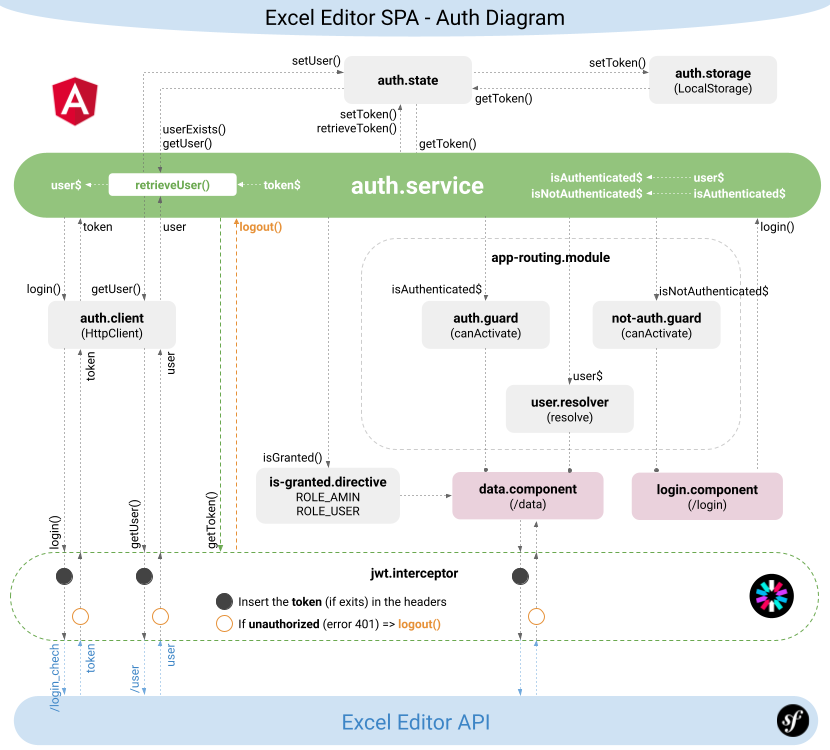
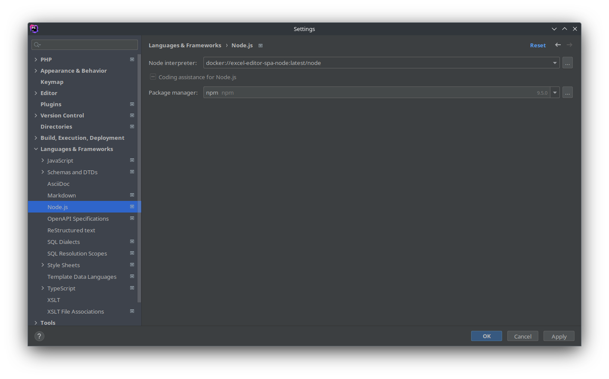
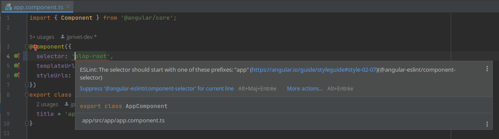
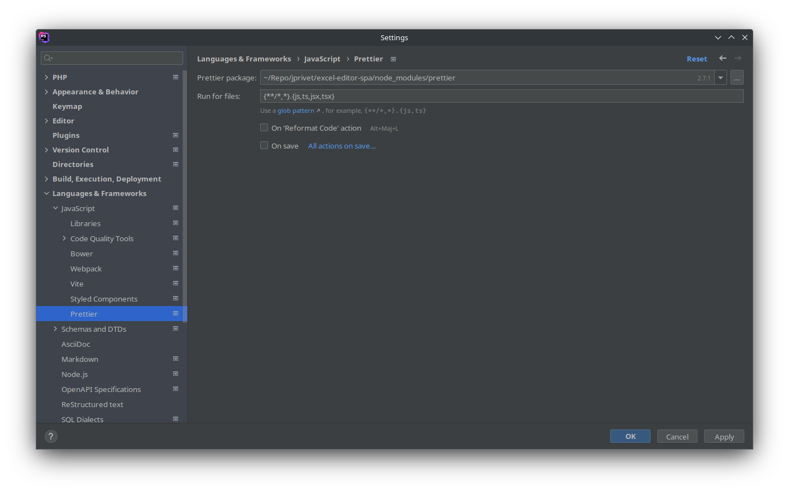

:toc: macro
:toc-title: Summary
:toclevels: 3
:numbered:

ifndef::env-github[:icons: font]
ifdef::env-github[]
:status:
:outfilesuffix: .adoc
:caution-caption: :fire:
:important-caption: :exclamation:
:note-caption: :paperclip:
:tip-caption: :bulb:
:warning-caption: :warning:
endif::[]

:back_to_top_target: top-target
:back_to_top_label: ⬆ Back to top
:back_to_top: <<{back_to_top_target},{back_to_top_label}>>

:main_title: Excel Editor SPA
:git_project_base: excel-editor
:git_project_api: {git_project_base}-api
:git_project_spa: {git_project_base}-spa
:git_project_insomnia: {git_project_base}-insomnia
:git_username: jprivet-dev
:git_url_api: https://github.com/{git_username}/{git_project_api}
:git_url_spa: https://github.com/{git_username}/{git_project_spa}
:git_url_insomnia: https://github.com/{git_username}/{git_project_insomnia}
:git_ssh_api: git@github.com:{git_username}/{git_project_api}
:git_ssh_spa: git@github.com:{git_username}/{git_project_spa}
:git_clone_ssh_api: git@github.com:{git_username}/{git_project_api}.git
:git_clone_ssh_spa: git@github.com:{git_username}/{git_project_spa}.git

:git_project_current: {git_project_spa}
:git_url_current: {git_url_spa}
:git_ssh_current: {git_ssh_spa}

:codacy_project_settings_coverage: https://app.codacy.com/gh/{git_username}/{git_project_api}/settings/coverage

// Releases
:project_release: v0.0.0-beta.2
:angular_release: 14.2.10

[#{back_to_top_target}]
= {main_title}

image:https://badgen.net/badge/release/{project_release}/blue[Project release,link=https://github.com/jprivet-dev/excel-editor-api/releases/tag/{project_release}]
image:https://badgen.net/badge/angular/{angular_release}/d93630[Angular release,link=https://github.com/angular/angular/releases/tag/{angular_release}]
image:https://app.codacy.com/project/badge/Grade/b95abb50479e4198becce900e64885da["Codacy code quality", link="https://www.codacy.com/gh/jprivet-dev/excel-editor-spa/dashboard?utm_source=github.com&utm_medium=referral&utm_content=jprivet-dev/excel-editor-spa&utm_campaign=Badge_Grade"]
image:https://app.codacy.com/project/badge/Coverage/b95abb50479e4198becce900e64885da["Codacy code quality", link="https://www.codacy.com/gh/jprivet-dev/excel-editor-spa/dashboard?utm_source=github.com&utm_medium=referral&utm_content=jprivet-dev/excel-editor-spa&utm_campaign=Badge_Coverage"]

toc::[]

== Presentation

=== SPA, API & Insomnia

Study of a complete application, with a {git_url_spa}[SPA (Angular)] and an {git_url_api}[API (Symfony)], which allows users to connect, and to be able, according to their rights, to import Excel data and modify them online.

|===
| Excel Editor SPA | {git_url_spa}
| Excel Editor API | {git_url_api}
| Excel Editor Insomnia | {git_url_insomnia}
|===

{back_to_top}

=== Diagrams

==== Global architecture

image::doc/img/excel-editor-architecture-diagram.png[]

{back_to_top}

==== Authentication & JWT



{back_to_top}

== Prerequisites

=== Docker Compose CLI

IMPORTANT: Be sure to install the latest version of https://docs.docker.com/compose/install/compose-plugin/[Docker Compose CLI plugin].

{back_to_top}

== Installation

WARNING: To use {git_url_spa}[Excel Editor SPA], you will need to install also {git_url_api}[Excel Editor API], an API made with Symfony.

. `$ git clone {git_ssh_current}`.
. `$ cd {git_project_current}`.
. `$ make build`: Build (the first time) or rebuild fresh images if necessary.
. `$ make start`: Create and start containers (alias: `$ make up`).
. Open http://localhost:4200
. `$ make stop`: Stop and remove containers, networks (alias: `$ make down`).

TIP: See all available commands with `$ make`.


{back_to_top}

== Main technical constraints for the study

* Use of the latest version of https://angular.io/[Angular].
* No https://ngrx.io/[NgRx Store]: the objective is to study in depth https://blog.angular-university.io/how-to-build-angular2-apps-using-rxjs-observable-data-services-pitfalls-to-avoid/[the observable data services and principles].
* Only https://material.angular.io/[Angular Material UI]: no merge with https://ng-bootstrap.github.io/[Bootstrap], https://tailwindcss.com/[tailwindcss], or other CSS frameworks.
* Use mainly the code generation commands (https://angular.io/cli/generate[ng generate]).
* The project must be dockerized.
* The project must have a consistent and correct code coverage.

{back_to_top}

== Style Guide

=== Angular coding style guide

[NOTE]
====
* https://angular.io/guide/styleguide
====

{back_to_top}

=== JSON naming convention

[NOTE]
====
* https://stackoverflow.com/questions/5543490/json-naming-convention-snake-case-camelcase-or-pascalcase
* https://google.github.io/styleguide/jsoncstyleguide.xml?showone=Property_Name_Format#Property_Name_Format
====

That project (API & SPA) use the `camelCase` format for the property names of JSON responses:

```
{
  "thisPropertyIsAnIdentifier": "identifier value"
}
```

{back_to_top}

== PHPStorm configuration

IMPORTANT: The following configuration are provided for *PHPStorm 2022.3.1*

=== Eslint & Prettier

==== Configure a remote Node.js interpreter [[configure-a-remote-node-js-interpreter]]

. Go in *Settings > Languages & Frameworks > Node.js*.
. In *Node interpreter*, click on *...* and *Add Remote...*.
. In the *Configure Node.js Remote Interpreter* window, choose *excel-editor-spa-node:latest* and click on *OK*.
. In the *Settings* window, click on *OK*.

image::doc/img/phpstorm-settings-node-remote-interpreter.png[]



{back_to_top}

==== Configure ESLint

NOTE: More information on https://www.jetbrains.com/help/phpstorm/eslint.html

CAUTION: Before you start: <<configure-a-remote-node-js-interpreter>>.

Configure in *Settings > Languages & Frameworks > JavaScript > Code Quality Tools > ESLint* :

image::doc/img/phpstorm-settings-eslint.png[]

After the configuration, you can see the ESLint alerts in your code. For example:



{back_to_top}

==== Configure Prettier

NOTE: More information on https://www.jetbrains.com/help/phpstorm/prettier.html

CAUTION: Before you start: <<configure-a-remote-node-js-interpreter>>.

Configure in *Settings > Languages & Frameworks > JavaScript > Prettier* :



{back_to_top}

==== Reformat with Prettier

After the configuration, you can reformat your code :

* With the shortcut *Ctrl+Alt+Maj+P*.
* From the contextual menu (*Right click > Reformat with Prettier*).

image::doc/img/phpstorm-settings-prettier-contextual-menu.png[]

TIP: It's possible to reformat on save.

To reformat on save, Go in *Settings > Languages & Frameworks > JavaScript > Prettier*, and check *On save* option:


If you click on *All actions on save...*, you will see the list of all activated actions:

image::doc/img/phpstorm-settings-tools-actions-on-save.png[]

TIP: I also use the *Optimize import* option. This removes unused imports and organizes import statements in the current file. See https://www.jetbrains.com/help/phpstorm/creating-and-optimizing-imports.html#optimize-imports.

{back_to_top}

== Codacy configuration

=== Code coverage

[NOTE]
====
* https://github.com/codacy/codacy-coverage-reporter
* https://github.com/karma-runner/karma-coverage
====

TIP: Karma: generate code coverage using https://istanbul.js.org/[Istanbul].

Duplicate `CODACY_PROJECT_TOKEN.sh`:

```
$ cp scripts/CODACY_PROJECT_TOKEN.sh.dist scripts/CODACY_PROJECT_TOKEN.sh
```

And define the API token `CODACY_PROJECT_TOKEN` (see {codacy_project_settings_coverage}).

The file `scripts/CODACY_PROJECT_TOKEN.sh` is ignored by *Git* and imported by `scripts/reporter.sh`.

The file `scripts/reporter.sh` generates code coverage (a `lcov.info` with *Instanbul*) and uploads the coverage reports on *Codacy*.

{back_to_top}

== Resources & Inspiration

=== Container & Presentational Components

* https://blog.angular-university.io/angular-component-design-how-to-avoid-custom-event-bubbling-and-extraneous-properties-in-the-local-component-tree/
* https://medium.com/@dan_abramov/smart-and-dumb-components-7ca2f9a7c7d0

This project is inspired by this pattern (which can quickly become an anti-pattern if applied dogmatically).

What are the main points?

* *Container (or Smart) components*:
** Components that are aware of the service layer (no @Input, no @Output).
** *Top-level components*: highest level of components, only for components attached to a route.
** Examples: UserPage, FollowersSidebar, StoryContainer, FollowedUserList.
* *Presentational components*:
*** Components that receive inputs and emit events, nothing else (no services, only @Input and @Ouput).
*** Examples: Sidebar, Story, UserInfo, List
* *A presentational component can contain a container component*: it allows for logic for interaction with the service layer to be put deeply into the component tree (if that is where it makes the most sense to have it), also to simplify the intermediate components and avoids code repetition.

[quote, ANGULAR UNIVERSITY]
____
In practice its actually much more practical to mix and match the multiple types of component design as we need, and use different types of components at different levels of the tree as necessary - mixing the different features as much as we need.
____

{back_to_top}

=== Observable Data Services

* https://blog.angular-university.io/how-to-build-angular2-apps-using-rxjs-observable-data-services-pitfalls-to-avoid/

This project uses simple stores with Observable Data Services, instead of @ngrx/store.

{back_to_top}

=== Design Patterns in Angular

* https://dev.to/armandotrue/design-patterns-in-angular-part-i-3ld7
* https://martinfowler.com/eaaCatalog/repository.html

{back_to_top}

=== Angular Service Layers

==== When to Use a Store And Why?

* https://blog.angular-university.io/angular-2-redux-ngrx-rxjs/
* https://medium.com/@dan_abramov/you-might-not-need-redux-be46360cf367#.z9abvda1k

[quote,ANGULAR UNIVERSITY]
You’ll know when you need Flux. If you aren’t sure if you need it, you don’t need it.

==== Alternative solutions in the Angular world, other than a store

* Inject services deep in the component tree.
* Inject components or services into each other if we feel they are inherently tightly coupled.
* Create shared data services that might or might not store the data.

==== Alternative to Redux: MobX

* https://github.com/mobxjs/mobx-angular

{back_to_top}

=== HTTP request & Cache

* https://blog.angulartraining.com/how-to-cache-the-result-of-an-http-request-with-angular-f9aebd33ab3

TIP: Use `shareReplay`: https://www.learnrxjs.io/learn-rxjs/operators/multicasting/sharereplay

{back_to_top}

=== JWT, Authentication & Permissions

* Communicating with backend services using HTTP: https://angular.io/guide/http
* Angular Authentication With JWT: https://blog.angular-university.io/angular-jwt-authentication/
* Angular Authentication: Using Route Guards
: https://medium.com/@ryanchenkie_40935/angular-authentication-using-route-guards-bf7a4ca13ae3
* JWT debugger: https://jwt.io/
* Angular permissions based on roles | Part 1. Roles, permissions and Permission Manager: https://medium.com/@rjlopezdev/angular-permissions-based-on-roles-part-1-roles-permissions-and-permission-manager-f3dde1bc82bb

NOTE: The authentication service of this project is mainly inspired by https://github.com/auth0/auth0-angular.

{back_to_top}

=== Error handling & Best practices

* https://angular.io/api/core/ErrorHandler
* https://blog.angular-university.io/rxjs-error-handling/
* https://medium.com/angular-in-depth/expecting-the-unexpected-best-practices-for-error-handling-in-angular-21c3662ef9e4
* https://www.intertech.com/angular-best-practice-rxjs-error-handling/
* https://itnext.io/how-to-handle-your-run-time-errors-in-your-angular-application-8d72fefbf8a4
* https://www.stacktracejs.com/

{back_to_top}

=== Architecture

* https://dev-academy.com/angular-architecture-best-practices/
* https://www.simform.com/blog/angular-best-practices/
* https://medium.com/dev-jam/5-tips-best-practices-to-organize-your-angular-project-e900db08702e
https://angular.io/guide/styleguide#lift
* https://stackoverflow.com/questions/70924931/angular-structure-best-practices-coremodule
* https://michelestieven.medium.com/organizing-angular-applications-f0510761d65a

{back_to_top}

=== Material

* Installation: https://material.angular.io/guide/getting-started
* Material Symbols: https://fonts.google.com/icons

{back_to_top}

== Troubleshooting

=== [webpack-dev-server] Disconnected!

I got the following console error on Chrome:

```
[webpack-dev-server] Disconnected! index.js:551
[webpack-dev-server] Trying to reconnect...
[webpack-dev-server] Disconnected! index.js:551
[webpack-dev-server] Trying to reconnect...
...
```

This is a problem when using SSL. See https://github.com/angular/angular-cli/issues/4839.

NOTE: I restart the project. I no longer have the disconnection problem, but the certificate is still not valid.

WARNING: *TODO*: Find out how to validate the certificate and complete this chapter with the solution.

{back_to_top}

=== Input type "file" isn't supported by matInput

Whaaaaat !??

```
ERROR Error: Input type "file" isn't supported by matInput.
```

[TIP]
====
Workaround :

* https://github.com/angular/components/issues/3262#issuecomment-309000588
* https://stackoverflow.com/questions/52622061/how-to-use-input-type-file-in-angular-material

```html
<button type="button" mat-raised-button (click)="fileInput.click()">Choose File</button>
<input hidden (change)="onFileSelected()" #fileInput type="file" id="file">
```

```typescript
onFileSelected() {
  const inputNode: any = document.querySelector('#file');

  if (typeof (FileReader) !== 'undefined') {
    const reader = new FileReader();

    reader.onload = (e: any) => {
      this.srcResult = e.target.result;
    };

    reader.readAsArrayBuffer(inputNode.files[0]);
  }
}
```
====


{back_to_top}

== Comments, suggestions?

Feel free to make comments/suggestions to me in the {git_url_current}/issues[Git issues section].

{back_to_top}

== License

"{main_title}" is released under the {git_url_current}/blob/main/LICENSE[*MIT License*]

---

{back_to_top}
