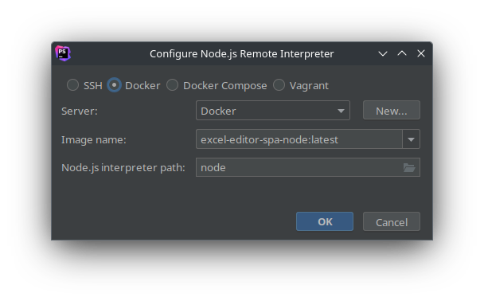
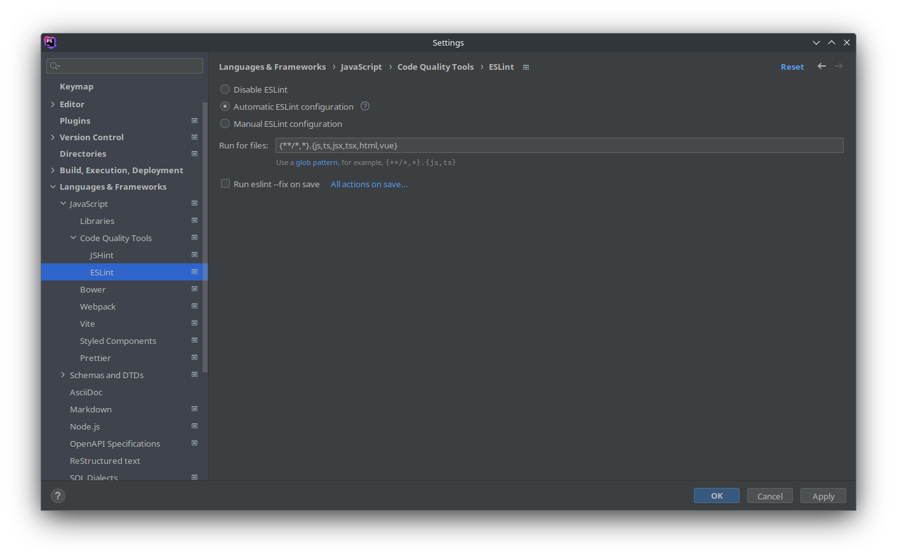
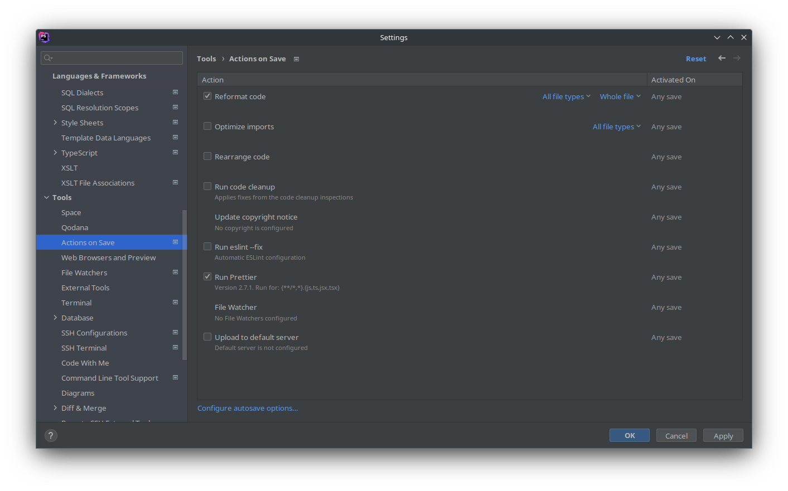

:toc: macro
:toc-title: Summary
:toclevels: 3
:numbered:

ifndef::env-github[:icons: font]
ifdef::env-github[]
:status:
:outfilesuffix: .adoc
:caution-caption: :fire:
:important-caption: :exclamation:
:note-caption: :paperclip:
:tip-caption: :bulb:
:warning-caption: :warning:
endif::[]

:back_to_top_target: top-target
:back_to_top_label: ⬆ Back to top
:back_to_top: <<{back_to_top_target},{back_to_top_label}>>

:main_title: Excel Editor (SPA with Angular)
:git_project_base: excel-editor
:git_project_api: {git_project_base}-api
:git_project_spa: {git_project_base}-spa
:git_project_insomnia: {git_project_base}-insomnia
:git_username: jprivet-dev
:git_url_api: https://github.com/{git_username}/{git_project_api}
:git_url_spa: https://github.com/{git_username}/{git_project_spa}
:git_url_insomnia: https://github.com/{git_username}/{git_project_insomnia}
:git_ssh_api: git@github.com:{git_username}/{git_project_api}
:git_ssh_spa: git@github.com:{git_username}/{git_project_spa}
:git_clone_ssh_api: git@github.com:{git_username}/{git_project_api}.git
:git_clone_ssh_spa: git@github.com:{git_username}/{git_project_spa}.git

:git_project_current: {git_project_spa}
:git_url_current: {git_url_spa}
:git_ssh_current: {git_ssh_spa}

// Releases
:project_release: v0.0.0-beta.0

[#{back_to_top_target}]
= {main_title}

image:https://badgen.net/badge/release/{project_release}/blue[Project release,link=https://github.com/jprivet-dev/excel-editor-api/releases/tag/{project_release}]
image:https://app.codacy.com/project/badge/Grade/b95abb50479e4198becce900e64885da["Codacy code quality", link="https://www.codacy.com/gh/jprivet-dev/excel-editor-spa/dashboard?utm_source=github.com&utm_medium=referral&utm_content=jprivet-dev/excel-editor-spa&utm_campaign=Badge_Grade"]

toc::[]

== Presentation

Study of an API (Symfony) and a SPA (Angular), to load data in CSV/Excel format, with consultation and modification of this data online.

|===
| API (Symfony/Docker) | {git_url_api}
| SPA (Angular/Docker) | {git_url_spa}
| Insomnia - design, debug and test the API (https://insomnia.rest/) | {git_url_insomnia}
|===

{back_to_top}

== Installation

This project was generated with https://github.com/angular/angular-cli[Angular CLI] version 14.0.4.

. `$ git clone {git_ssh_current}`.
. `$ cd {git_project_current}`.
. `$ make build`: Build (the first time) or rebuild fresh images if necessary.
. `$ make start`: Create and start containers (alias: `$ make up`).
. Open http://localhost:4200
. `$ make stop`: Stop and remove containers, networks (alias: `$ make down`).

{back_to_top}

== PHPStorm configuration

IMPORTANT: The following configuration are provided for *PHPStorm 2022.3.1*

=== Eslint & Prettier

==== Configure a remote Node.js interpreter [[configure-a-remote-node-js-interpreter]]

. Go in *Settings > Languages & Frameworks > Node.js*.
. In *Node interpreter*, click on *...* and *Add Remote...*.
. In the *Configure Node.js Remote Interpreter* window, choose *excel-editor-spa-node:latest* and click on *OK*.
. In the *Settings* window, click on *OK*.

image::doc/img/phpstorm-settings-node.png[]

{back_to_top}

==== Configure ESLint

NOTE: More information on https://www.jetbrains.com/help/phpstorm/eslint.html

CAUTION: Before you start: <<configure-a-remote-node-js-interpreter>>.

Configure in *Settings > Languages & Frameworks > JavaScript > Code Quality Tools > ESLint* :

After the configuration, you can see the ESLint alerts in your code. For example:

image::doc/img/phpstorm-settings-eslint-error.png[]

{back_to_top}

==== Configure Prettier

NOTE: More information on https://www.jetbrains.com/help/phpstorm/prettier.html

CAUTION: Before you start: <<configure-a-remote-node-js-interpreter>>.

Configure in *Settings > Languages & Frameworks > JavaScript > Prettier* :

image::doc/img/phpstorm-settings-prettier.png[]

{back_to_top}

==== Reformat with Prettier

After the configuration, you can reformat your code :

* With the shortcut *Ctrl+Alt+Maj+P*.
* From the contextual menu (*Right click > Reformat with Prettier*).

image::doc/img/phpstorm-settings-prettier-contextual-menu.png[]

TIP: It's possible to reformat on save.

To reformat on save, Go in *Settings > Languages & Frameworks > JavaScript > Prettier*, and check *On save* option:

image::doc/img/phpstorm-settings-prettier-on-save.png[]

If you click on *All actions on save...*, you will see the list of all activated actions:

TIP: I also use the *Optimize import* option. This removes unused imports and organizes import statements in the current file. See https://www.jetbrains.com/help/phpstorm/creating-and-optimizing-imports.html#optimize-imports.

{back_to_top}

== Resources & Inspiration

* Angular Authentication With JWT: https://blog.angular-university.io/angular-jwt-authentication/
* Angular Authentication: Using Route Guards
: https://medium.com/@ryanchenkie_40935/angular-authentication-using-route-guards-bf7a4ca13ae3
* JWT debugger: https://jwt.io/

{back_to_top}

== Comments, suggestions?

Feel free to make comments/suggestions to me in the {git_url_current}/issues[Git issues section].

{back_to_top}

== License

"{main_title}" is released under the {git_url_current}/blob/main/LICENSE[*MIT License*]

---

{back_to_top}
